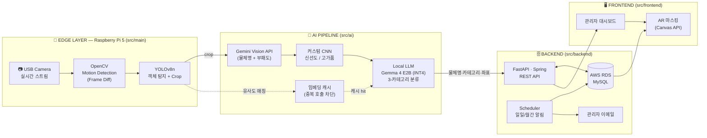
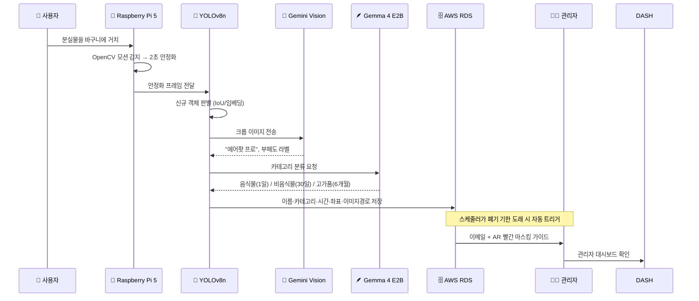

# 분실물 자동 추론 및 시각화 관리 AI 시스템
### 2026 AI 캡스톤디자인 · 동양미래대학교 · 팀 **상부상조 (2조)**

> **라즈베리파이 엣지 컴퓨팅 + 하이브리드 AI**(YOLOv8 + Gemini Vision + 로컬 LLM)를 결합해
> 분실물의 **인식 · 분류 · 폐기 가이드**를 완전 무인으로 자동화하는 시스템.

`EDGE × MULTIMODAL × LLM` — 음식물(1일) / 비음식물(30일) / 고가품(6개월) **3-카테고리 자동 분기**

---

## 📌 빠른 링크 (Quick Links)

| 구분 | 링크 |
|------|------|
| 🎬 현 상황 데모 | [Google Drive 영상](https://drive.google.com/file/d/1jm0rw15vPh_qfNWp1wrNx_rkewdpraTZ/view?usp=sharing) |
| 📝 팀 프로젝트 기획서 (최신) | [doc/팀 프로젝트기획서.pdf](doc/%ED%8C%80%20%ED%94%84%EB%A1%9C%EC%A0%9D%ED%8A%B8%EA%B8%B0%ED%9A%8D%EC%84%9C.pdf) |
| 🧠 핵심 개념 증명 | [doc/01 캡스톤 개념 증명.pdf](doc/01%20%EC%BA%A1%EC%8A%A4%ED%86%A4%20%EA%B0%9C%EB%85%90%20%EC%A6%9D%EB%AA%85.pdf) |
| 💰 API 토큰/비용 예측 | [doc/02 캡스톤 API 토큰 및 가격 예측.pdf](doc/02%20%EC%BA%A1%EC%8A%A4%ED%86%A4%20API%20%ED%86%A0%ED%81%B0%20%EB%B0%8F%20%EA%B0%80%EA%B2%A9%20%EC%98%88%EC%B8%A1.pdf) |
| 📒 진행사항 보드 (Notion) | [바로가기](https://www.notion.so/33b2b2979d1880ca8c62d807f22375fb?source=copy_link) |
| 🗂 회의록 모음 | [doc/Meeting_Minutes/](doc/Meeting_Minutes) |

---

## 👥 팀원 및 역할 (Team & Roles)

> 기준: 팀 프로젝트 기획서(2026.05.12 v1.0)의 최신 역할 분담.

| 학번 | 이름 | 역할 | 주요 담당 영역 | 개인 SDL 저장소 |
|------|------|------|----------------|------------------|
| 20241499 | **장진석** | **PM / Full-Stack** | 작업 관리 및 코어 작업(OpenCV / AI API 통합), 라즈베리파이 하드웨어 제어 (OpenCV 연동) | [Jinseok2419342/2026-Capstone-SDL](https://github.com/Jinseok2419342/2026-Capstone-SDL) |
| 20241504 | **김지훈** | **Backend · AI** | FastAPI · Spring 기반 REST API 설계, AWS RDS(MySQL) 연동, 데이터 전처리 파이프라인 및 커스텀 AI 모델 학습 | [seusik1122/ai-capstone](https://github.com/seusik1122/ai-capstone.git) |
| 20241516 | **권기원** | **Backend** | 하이브리드 AI 추론 최적화(파이프라인 분리 · 임베딩 캐시), AWS 인프라 구성 보조, 사용성(UX) 테스트 주도 | [giwon1115/3-1-ai](https://github.com/giwon1115/3-1-ai) |
| 20241505 | **고지호** | **Frontend** | HTML · CSS · JS 기반 관리자 대시보드 설계 및 구현, AR-Style 마스킹 필터 렌더링 (Canvas API) | [jiho050718/2026-QA-Capstone](https://github.com/jiho050718/2026-QA-Capstone) |

---

## 📂 프로젝트 구조 (Project Structure)

> 기획서 §1.1에서 정의한 디렉토리 정책을 그대로 반영했습니다.

```text
Capstone-team-project
├── 📂 src/
│   ├── 📂 main/          # 카메라 제어, OpenCV 모션 감지 코드 등 (엣지 진입점)
│   ├── 📂 backend/       # FastAPI · Spring Boot 서버, AWS 연동 코드
│   ├── 📂 frontend/      # 관리자 대시보드 HTML/CSS/JS
│   ├── 📂 ai/            # 커스텀 모델 학습 · 추론 코드, 데이터 전처리 스크립트
│   ├── 📂 asset/         # 런타임 산출물 (crops 등)
│   ├── 📂 test/          # 단위/통합 테스트
│   ├── main.py           # 현재 PoC 통합 진입점 (모션 → YOLO → 멀티모달 API)
│   └── Setting_Guide.md  # venv & 패키지 설치 가이드
├── 📂 doc/               # 회의록, 기획서, 선행연구 PDF
│   ├── Meeting_Minutes/  # 회의록 01~04
│   └── Original_Ideas/   # 최초 개인별 아이디어 제안서
├── yolov8n.pt            # YOLOv8 nano 가중치
├── requirements.txt
├── LICENSE
└── README.md
```

기능 단위 디렉토리 분리 · **Pull Request 기반 코드 리뷰** 운영.

---

## 🧭 시스템 아키텍처 (System Architecture)



---

## 🔁 처리 파이프라인 (5-Step Flow · 기획서 §1.5)



---

## 🛠️ 기술 스택 (Tech Stack · 기획서 §2.5 + 회의록 02 확정)

| Layer | 사용 기술 |
|-------|-----------|
| **HW · Edge** | Raspberry Pi 5, USB Camera, Python 3.11.9 |
| **CV / Detection** | OpenCV, YOLOv8 (`yolov8n.pt`, Ultralytics) |
| **Multimodal AI** | **Gemini Vision API** (메인) / GPT-4o (PoC 단계 대안) |
| **Light LLM** | **Gemma 4 E2B** 로컬 (Raspberry Pi 5 · 4GB RAM · INT4, 7.6 tokens/sec 실측) |
| **커스텀 모델** | CNN — 신선도 / 고가품 분류 (Roboflow Universe + Kaggle Fresh-vs-Rotten Fine-tuning) |
| **Backend** | **FastAPI** · Spring Boot (검토), Python 3.11.9 |
| **Database** | **AWS RDS (MySQL)** — 회의록 02에서 확정 |
| **Cloud / Infra** | AWS (RDS · S3 · Budgets 알람), Oracle Free Tier 이주 옵션 |
| **Frontend** | Vanilla JS (+ React 검토), **Canvas API** (`drawRect` + `globalAlpha`로 AR 마스킹) |
| **Dev / Collab** | GitHub (PR 리뷰), Notion, GitHub Copilot, Claude / Cursor (개발 보조) |

---

## 🚀 개발 환경 셋업 (Setup)

> 자세한 단계는 [src/Setting_Guide.md](src/Setting_Guide.md) 참조.

```powershell
# 1) Python 3.11.9 설치 (PATH 추가 필수)
# 2) 가상환경 생성 & 활성화
python -m venv venv
venv\Scripts\activate              # Windows
# source venv/bin/activate         # macOS / Linux

# 3) 의존성 설치
python -m pip install -r requirements.txt

# 4) PoC 실행 (모션 감지 → YOLO → 멀티모달 API)
python src/main.py
```

> `.env` 파일을 프로젝트 루트에 두고 멀티모달 API 키를 설정하세요.

---

## 🎯 정량 목표 & 기대효과 (기획서 §1.6)

| 지표 | 목표값 |
|------|--------|
| 커스텀 CNN 분류 정확도 (신선도 · 고가품) | **≥ 85 %** |
| 물체 감지 → DB 저장 처리 시간 | **≤ 10 초** |
| 임베딩 캐시 적용 시 멀티모달 API 호출 절감 | **≥ 30 %** |
| 1학기말까지 핵심 기능 데모 프로토타입 | **완성** |

**정성 효과** : ① 관리 효율 (수기 입력 제거) · ② 위생 강화 (음식물 신속 처리) · ③ 실무 풀스택 협업 경험.

---

## 🧪 핵심 개념 증명 (Proof of Concept)

- 640×480 저해상도 + Gaussian 인공 노이즈 환경에서 크롭 후 각각 **158×135 / 180×149** 해상도까지 떨어진 이미지로도 **Gemini가 정답 분류**(`earbuds case`, `power adapter`)에 성공.
- 비용 예측 (양 변 384px 이하 · ≈ 373 tokens/호출):
  - Gemini 3.1 Pro : **$0.000736 / 호출** → 1,000회 ≈ 1,107원
  - Gemini 3 Flash : $0.000184 / 호출
  - Gemini 3.1 Flash-Lite : $0.000092 / 호출
- 자세한 수치는 [doc/02 캡스톤 API 토큰 및 가격 예측.pdf](doc/02%20%EC%BA%A1%EC%8A%A4%ED%86%A4%20API%20%ED%86%A0%ED%81%B0%20%EB%B0%8F%20%EA%B0%80%EA%B2%A9%20%EC%98%88%EC%B8%A1.pdf) 참조.

---

## 🗓️ 추진 일정 (Gantt · 14주 · 기획서 §3.1)

| Phase | 기간 | 주요 산출물 |
|-------|------|-------------|
| **P1** 기획 · 개념 검증 | 3–5주 | 아이디어 제안서, 개념증명 문서 (**M1**) |
| **P2** 환경 구축 · 핵심 파이프라인 | 5–9주 | 데이터 검토, 전처리, `main.py` 통합 (**M2** — 카메라→API 끊김없는 동작) |
| **P3** 데이터 학습 · DB 통합 | 9–12주 | RDS · FastAPI · 카테고리 분류 · 관리자 페이지 (**M3** — DB 자동 누적 + 실시간 조회) |
| **P4** 프로토타입 통합 · 테스트 | 12–14주 | AR 마스킹, 알림, 유저 테스트, 데모 (**M4**) |

---

## 🧩 핵심 과제와 해결 전략

| 이슈 | 해결 전략 (기획서 §4.2 · 회의록 종합) |
|------|----------------------------------------|
| **Occlusion** (물건 겹침) | 단기: Confidence Score 튜닝 + 다중 박스 / 중장기: 라파 스피커·LED 능동 유도 |
| **회수 / 위치 변경 감지** | IoU + 임베딩 코사인 유사도 기반 Re-Identification, DB 상태 `회수됨` 자동 갱신 |
| **API 비용 폭증** | 이미지=고성능 API / 텍스트=Lite LLM 파이프라인 분리, 임베딩 유사도 캐시로 중복 호출 차단 (Pro/Flash/Flash-Lite 자동 전환 시 60–70 % 절감 목표) |
| **AWS 비용 만료** | 팀원 프리티어 계정 순환, Oracle Cloud Free Tier 이주 옵션 (회의록 02) |
| **신선도 라벨링 비용** | Kaggle Fresh-vs-Rotten은 **API 위임**으로 결정 (라벨링 비용 회피) |

---

## 📚 데이터셋 (기획서 §2.4)

| 출처 | 용도 | 비고 |
|------|------|------|
| **MS COCO 2017** (118K / 80 cls) | YOLOv8 사전학습 | 일반 물품 즉시 탐지 |
| **Roboflow Universe** | YOLOv8 Fine-tuning | 에어팟·지갑 등 고가품 보강 |
| **Fresh vs Rotten** (Kaggle / Hugging Face, ~13K) | 신선도 판별 | 박스 어노테이션 부재 → **Gemini API 위임** |

**전처리 5단계** (회의록 04 합의) : 리사이징·정규화(224/256) → 라벨 노이즈 제거 → 데이터 증강(Albumentations) → 클래스 불균형 처리 → Train/Val/Test 분할(8:1:1 또는 7:2:1).

---

## 🗂️ 회의록 요약 (doc/Meeting_Minutes)

| # | 일자 | 결정사항 |
|---|------|----------|
| [01](doc/Meeting_Minutes) | 2026.03.24 | 역할 분담 1차 — PM/FullStack, Backend×2, Frontend 확정 |
| [02](doc/Meeting_Minutes) | 2026.03.31 | **DB 솔루션 = AWS** 확정 (RDS/MySQL), Budgets 알람 우선 설정 |
| [03](doc/Meeting_Minutes) | 2026.04.07 | 커스텀 학습 단계 도입 결정 (고가품 분류 + 음식 부패도 모델) |
| [04](doc/Meeting_Minutes) | 2026.04.14 | 전처리 파이프라인 합의 (리사이즈/증강 우선, 라벨 노이즈는 분담 진행) |

---

## 🖼️ 청사진 (Blueprint)


---

## 📜 License

This project is licensed under the terms of the [LICENSE](LICENSE) file.
